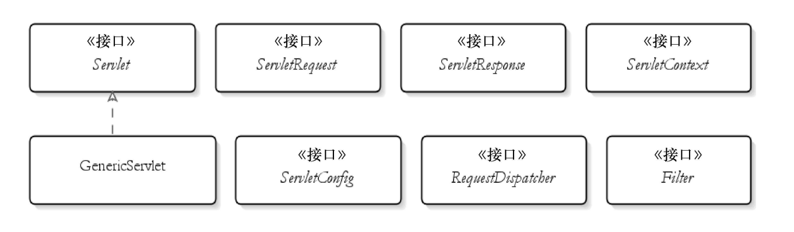
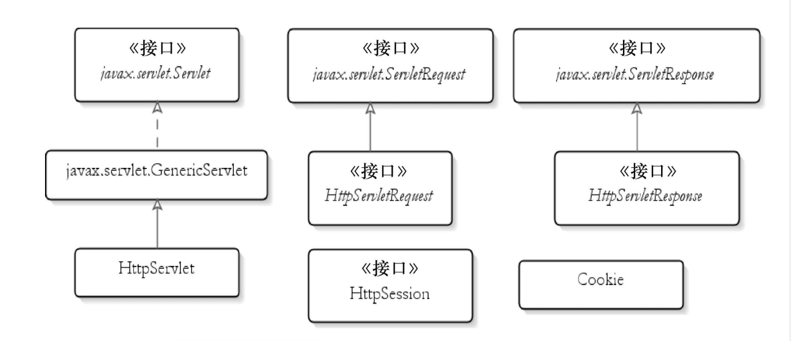

# Servlet & JSP Record

工作中接触的第一个项目居然是Servlet&JSP的项目，为此来学学第一代Java Web。

书籍：《Servlet和JSP学习指南》、《Servlet JSP和Spring MVC初学指南》

## Servlet

Servlet API 有四个Java包：

1. javax.servlet， 其中包含定义Servlet和Servlet容器之间契约的类和接口。
2. javax.servlet.http， 其中包含定义HTTP Servlet和Servlet容器之间契约的类和接口。
3. javax.servlet.annotation， 其中包含标注Servlet、Filter、 Listener的标注。 它还为被标注元件定义元数据。
4. javax.servlet.descriptor， 其中包含提供程序化登录web应用程序的配置信息的类型。 

### javax.servlet



#### Servlet 接口五个方法

``` java
void init(ServletConfig config) throws ServletException
void service(ServletRequest request, ServletResponse response) throws ServletException, java.io.IOException
void destroy()
java.lang.String getServletInfo()
ServletConfig getServletConfig()
```

init()、 service() 和 destroy() 是生命周期方法。 Servlet 容器根据以下规则调用这3个方法： 

- init， 当该Servlet第一次被请求时， Servlet容器会调用这个方法。 这个方法在后续请求中不会再被调用。 我们可以利用这个方法执行相应初始化工作。调用这个方法时， Servlet容器会传入一个ServletConfig。 一般来说， 你会将ServletConfig赋给一个类级变量， 因此这个对象可以通过Servlet类的其他点来使用。 
- service， 每当请求Servlet时， Servlet容器就会调用这个方法。 编写代码时， 是假设Servlet要在这里被请求。 第一次请求Servlet时， Servlet容器调用init方法和service方法。 后续的请求将只调用service方法。
- destroy， 当要销毁Servlet时， Servlet容器就会调用这个方法。 当要卸载应用程序， 或者当要关闭Servlet容器时， 就会发生这种情况。 一般会在这个方法中编写清除代码。 

Servlet 中的另外两个方法是非生命周期方法， 即 getServletInfo() 和 getServletConfig() ： 

- getServletInfo， 这个方法会返回Servlet的描述。 你可以返回有用或为null的任意字符串。 
- getServletConfig， 这个方法会返回由Servlet容器传给init方法的ServletConfig。 但是， 为了让getServletConfig返回一个非null值， 必须将传给init方法的ServletConfig赋给一个类级变量。

#### ServletRequest

对于每一个HTTP请求， Servlet容器都会创建一个ServletRequest实例， 并将它传给Servlet的Service方法。ServletRequest封装了关于这个请求的信息。 

ServletRequest接口中有一些以下方法 ：

``` java
public int getContentLength()
// 返回请求主体的字节数。 如果不知道字节长度， 这个方法就会返回−1。
  
public java.lang.String getContentType()
// 返回请求主体的MIME类型， 如果不知道类型， 则返回null。
  
public java.lang.String getParameter(java.lang.String name)
// 返回指定请求参数的值。
  
public java.lang.String getProtocol()
// 返回这个HTTP请求的协议名称和版本。
```

#### ServletResponse

javax.servlet.ServletResponse接口表示一个Servlet响应。 在调用Servlet的Service方法前， Servlet容器首先创建一个ServletResponse， 并将它作为第二个参数传给Service方法。 ServletResponse隐藏了向浏览器发送响应的复杂过程。 

ServletRespon 中定义了getWriter() 方法， 它返回了一个可以向客户端发送文本的java.io.PrintWriter。 默认情况下， PrintWriter对象使用**ISO-8859-1**编码。

> **注意：**
>
> ​	还有一个方法可以用来向浏览器发送输出， 它就是getOutputStream。 但这个方法是用于发送二进制数据的， 因此， 大多数情况使用的是getWriter， 而不是getOutputStream。 

在发送任何HTML标签前， 应该先调用**setContentType**方法， 设置响应的内容类型， 并
将`“text/html”`作为一个参数传入。 这是在告诉浏览器，内容类型为HTML。 在没有内容类型的情况下， 大多数浏览器会默认将响应渲染成HTML。 但是， 如果没有设置响应内容类型， 有些浏览器就会将HTML标签显示为普通文本。 

#### ServletConfig

当Servlet容器初始化Servlet时， Servlet容器会给Servlet的init方法传入一个ServletConfig。 ServletConfig封装可以通过@WebServlet或者部署描述符(**web.xml**)传给Servlet的配置信息。 这样传入的每一条信息就叫一个初始参数。 一个初始参数有key和value两个元件。 

``` java
// 为了从Servlet内部获取到初始参数的值，要在Servlet容器传给Servlet的init方法ServletConfig中调用getInitParameter方法。
java.lang.String getInitParameter(java.lang.String name)
  
// getInitParameterNames方法则是返回所有初始参数名称的一个Enumeration.
java.util.Enumeration<java.lang.String> getInitParameterNames()
  
// getServletContext方法可以从Servlet内部获取ServletContext。
ServletContext getServletContext()
```

下面一个例子，在@WebServlet的initParams属性中， 给Servlet传入了两个初始参数（admin和email） 

``` java
@WebServlet(name = "ServletConfigDemoServlet",
		urlPatterns = "/02",
		initParams = {
				@WebInitParam(name = "admin", value = "Harry Taciak"),
				@WebInitParam(name = "email", value = "admin@example.com")
		})
public class ServletConfigDemoServlet implements Servlet {
    ...
    ...
  @Override
	public void service(ServletRequest servletRequest, ServletResponse servletResponse) throws ServletException, IOException {
		String admin = servletConfig.getInitParameter("admin");
		String email = servletConfig.getInitParameter("email");
      ....
      ....
    }
   ...
   ...
}
```

#### ServletContext

ServletContext表示Servlet应用程序。 每个Web应用程序只有一个上下文。 在将一个应用程序同时部署到多个容器的分布式环境中， 每台Java虚拟机上的Web应用都会有一个ServletContext对象。 

获得了ServletContext， 就可以共享从应用程序中的所有资料处访问到的信息， 并且可以动态注册Web对象。前者将对象保存在ServletContext中的一个内部Map中。保存在ServletContext中的对象被称作属性。 

ServletContext中的下列方法负责处理属性： 

```java
// 返回指定名称的servlet容器属性值，如果没有该名称的属性则返回 null。
java.lang.Object getAttribute(java.lang.String name)

// 返回一个Enumeration包含此Servlet上下文中可用的属性名称。
java.util.Enumeration<java.lang.String> getAttributeNames()

// 在此Servlet上下文中将对象绑定到给定的属性名称。
void setAttribute(java.lang.String name, java.lang.Object object)

// 从servlet上下文中删除具有给定名称的属性。
void removeAttribute(java.lang.String name)
```

#### GenericServlet

GenericServlet实现了Servlet和ServletConfig接口， 并完成以下任务： 

- 将init方法中的ServletConfig赋给一个类级变量， 以便可以通过调用getServletConfig获取。 
- 为Servlet接口中的所有方法提供默认的实现。 
- 提供方法，包围ServletConfig中的方法。 

### javax.servlet.http

javax.servlet.http包是Servlet API中的第二个包， 其中包含了用于编写Servlet应用程序的类和接口。javax.servlet.http中的许多类型都覆盖了javax.servlet中的类型 



#### HttpServlet

HttpServlet类覆盖了javax.servlet.GenericServlet类。使用HttpServlet时， 还要借助分别代表Servlet请求和Servlet响应的HttpServletRequest和HttpServletResponse对象。 

HttpServletRequest接口扩展javax.servlet.ServletRequest。

HttpServletResponse扩展javax.servlet.ServletResponse。

HttpServlet中的Service方法会检验用来发送请求的HTTP方法（通过调用request.getMethod） ， 并调用以下方法之一： doGet、 doPost、 doHead、 doPut、
doTrace、 doOptions和doDelete。 这7种方法中， 每一种方法都表示一个HTTP方法。 **doGet**和**doPost**是最常用的。 因此， 不再需要覆盖Service方法了， 只要覆盖doGet或者doPost， 或者覆盖doGet和doPost即可。

总之， HttpServlet有两个特性是GenericServlet所不具备的：

1. 不用覆盖Service方法， 而是覆盖doGet或者doPost，或者覆盖doGet和doPost。 在少数情况下， 还会覆盖以下任意方法： doHead、 doPut、 doTrace、doOptions和doDelete。
2. 使用HttpServletRequest和HttpServletResponse， 而不是ServletRequest和ServletResponse。 

#### HttpServletRequest

HttpServletRequest表示HTTP环境中的Servlet请求。 它扩展javax.servlet.ServletRequest接口， 并添加了几个方法。  

``` java
// 返回表示请求上下文的请求URI部分。
java.lang.String getContextPath()

// 返回一个Cookie对象数组。
Cookie[] getCookies()

// 返回指定HTTP标题的值。
java.lang.String getHeader(java.lang.String name)

// 返回生成这个请求的HTTP方法名称。
java.lang.String getMethod()

// 返回请求URL中的查询字符串。
java.lang.String getQueryString()

// 返回与这个请求相关的会话对象。 如果没有， 将创建一个新的会话对象
HttpSession getSession()

// 返回与这个请求相关的会话对象。 
// 如果有， 并且create参数为True， 将创建一个新的会话对象。
HttpSession getSession(boolean create)
```

#### HTTPServletResponse

HttpServletResponse表示HTTP环境中的Servlet响应。

``` java
// 给这个响应对象添加一个cookie。
void addCookie(Cookie cookie)

// 给这个响应对象添加一个header。
void addHeader(java.lang.String name, java.lang.String value)

// 发送一条响应码， 将浏览器跳转到指定的位置。(重定向)
void sendRedirect(java.lang.String location)
```

#### 处理HTML表单

- HTML输入域（文本域、 隐藏域或者密码域），当页面输入域存在名称的，ServletRequest.**getParameter 不会返回NULL**。
- HTML select元素 （单选`<select>`、多选`<select multiple>`）
  - 当为单选时getParameter会返回**第一个或默认或选中**的选项值；
  - 当为多选时getParameter会返回类似`[Ljava.lang.String;@508e67` 的地址，因为此时是一个`String[]` 的字符串数组 ，可以用**getParameterValues** 获取所有选中值的集合，然后遍历出来；当**没有选中值**时会返回**NULL**。
- HTML 复选框（单选`<input type="radio">`、多选`<input type="checkbox">`）
  - 不管是单选还是多选，如果选中的选项**没有vlue属性**，则会返回“**on**”；
  - 当为单选时getParameter会返回**选中**的选项值，**没有选中**的值时返回**NULL** ；
  - 当为多选时getParameter会返回所有选中值中排序**最后**的值，可以用**getParameterValues** 获取所有选中值，当**没有选中值**时会返回**NULL**。

### 部署描述符 

部署描述符总是命名为web.xml， 并且放在WEBINF目录下。 

使用部署描述符的好处 ：

1. 可以使用在@WebServlet中没有的元素， 如load-on-startup元素。 这个元素使得Servlet在应用程序启动时加载， 而不是在第一次调用时加载。 如果Servlet的init方法需要花一些时间才能完成的话， 使用load-on-startup意味着第一次调用Servlet所花的时间并不比后续的调用长， 这项功能就特别有用 。
2. 如果需要修改配置值， 如Servlet路径， 则不需要重新编译Servlet类。此外， 可以将初始参数传给一个Servlet， 并且不需要重新编译Servlet类， 就可以对它们进行编辑。 
3. 部署描述符还允许覆盖在Servlet标注中定义的值。Servlet上的WebServlet标注如果同时也在部署描述符中进行声明， 那么它将不起作用。 然而， 在有部署描述符的应用程序中， 却不在部署描述符中标注Servlet时， 则仍然有效。 这意味着， 可以标注Servlet， 并在同一个应用程序的部署描述符中声明这些Servlet。 